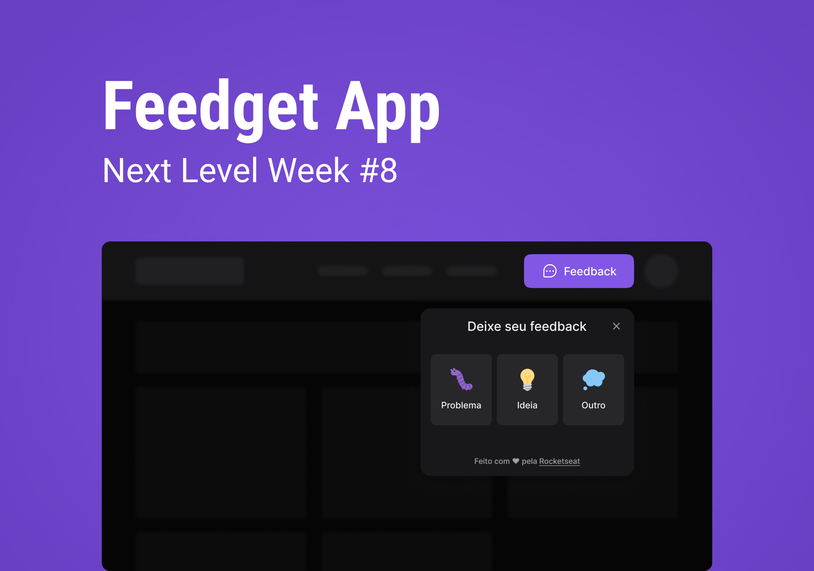

## Feedget App



## 💻 Projeto

Aplicação desenvolvida com o objetivo de fornecer um formulário simples de feedback para produtos e serviços em ambientes web e mobile. Além do comentário por escrito, o cliente pode tirar um screenshot da tela, enviando automaticamente as informaçõesao banco de dados e ao e-mail do responsável pelo produto/serviço.

Projeto desenvolvido durante a Next Level Week, evento organizado pela [Rocketseat](https://github.com/rocketseat-education/).

## 💡 Features

- 👍 Envio rápido e intuitivo de feedback por parte do usuário;
- 📷 Botão personalizado para o envio de screenshots;
- 📩 Recebimento das informações do feedback pelo dono da aplicação por e-mail.

## 👨🏽‍💻 Tecnologias

- [ ] TailwindCSS
- [ ] TypeScript
- [ ] NodeJS
- [ ] Express
- [ ] Prisma
- [ ] Jest
- [ ] PostgreSQL

## ⚙ Executando o projeto

Utilize o **yarn** ou o **npm install** para instalar as dependências do projeto.
Em seguida, inicie o projeto.

```cl
expo start
```

Lembre-se de criar o seu App no servidor do Discord para obter as credencias de autenticação. Em seguida, defina no arquivo .env as configurações do seu App (remova o example do arquivo .env.example).

```cl
REDIRECT_URI=
SCOPE=
RESPONSE_TYPE=
CLIENT_ID=
CDN_IMAGE=
```

## 🔖 Layout

Você pode visualizar o layout do projeto através [desse link](https://www.figma.com/file/AIsF3iohbA66ROHjmNArvv/Feedget-App?node-id=142%3A1270). É necessário ter conta no [Figma](http://figma.com/) para acessá-lo.

## 📄 Licença

Esse projeto está sob a licença MIT. Veja o arquivo [LICENSE](LICENSE.md) para mais detalhes.

<br />
